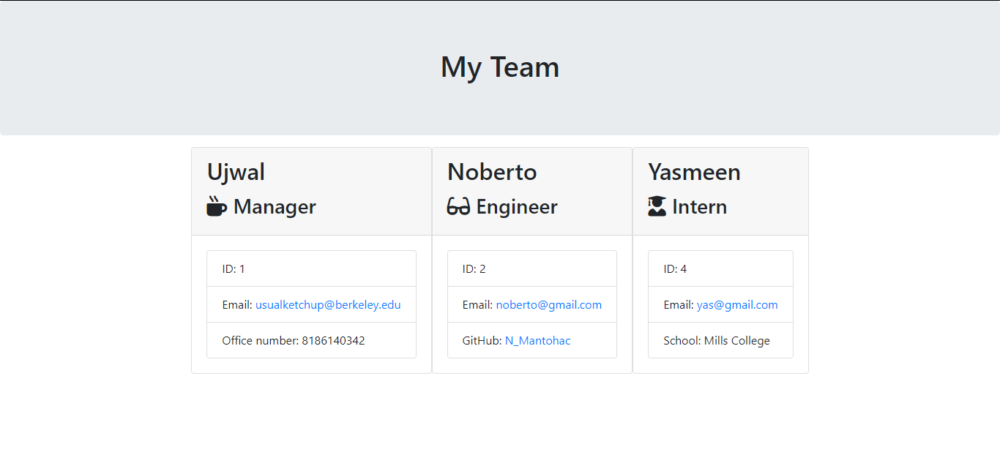

# Team Member Summary

## URL Links:

* GitHub: https://github.com/usualketchup/teammembersummary
* Working video: https://drive.google.com/file/d/1yaDiNhOGdLTHOlSw1EJZsH1hPxhC-RMy/view

## Description:
A team profile generator that renders an HTML page based on the user's answers to a series of prompts utilizing Inquirer (npm). A series of prompts will show up after the user clones/downloads this repo, and runs npm install and node app.js in VS Code's terminal. In general, the HTML page displays the team member's name, role, id, email, and a specific piece of information that is unique to that role. For managers, it is the office number; for engineers, it is the GitHub name; and for interns, it is the school name. In addition, the user can run test cases and check if they pass by typing in npm run test in the terminal.
The team profile generator is done through HTML and Javascript code in Visual Studio Code, and utilizes Bootstrap with its components and utilities. There are large amounts of javascript files, but overall they contain variables (const/let), functions, if-else statements, and classes and constructors. The team.html is rendered by the htmlRenderer.js file, whereas the app.js file is the main javascript file that prompts the user the necessary questions to display the information in the team.html file. In addition, npm installation was used in order to install Inquirer for the questions prompts, and Jest to run the test cases.

## Technologies Used:
  * Visual Studio Code
  * HTML, Javascript
  * Bootstrap
  * npm - Inquirer
  * npm - Jest

## Challenges:
This homework wasn't as hard as I thought it would be because I just had to create the classes for all of the team members! Getting the code to render the team.html document took some time but once I figured it out the assignment went quite well!

## Working Screenshot:
